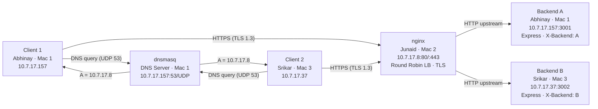

# RouteX — CN Course Project (Phase 1: Build & Observe)

**3-Mac topology · hostel Wi-Fi `10.7.0.0/19`**

## Team

| Mac | Person | Roles | IP |
|-----|--------|-------|----|
| Mac 1 | **Abhinay (Manikanta)** | DNS Server · Backend A · Client 1 | `10.7.17.157` |
| Mac 2 | **Junaid** | Nginx Edge · Reverse Proxy · Load Balancer · TLS | `10.7.17.8` |
| Mac 3 | **Srikar** | Backend B · Client 2 · Wireshark capture | `10.7.17.37` |

## Architecture



## Request Path

```
Client → DNS (Mac 1:53) → edge (Mac 2:443) → nginx LB → Backend A or B
```

> Both `app.routex.test` and `api.routex.test` resolve to `10.7.17.8` (the edge).
> The edge terminates TLS and round-robins to the two backends over plain HTTP.

## Task Progress

- [x] **A** — Private LAN: IPs pinned, ping matrix, topology diagram
- [x] **B** — Private DNS (dnsmasq on Mac 1), clients pointed at it
- [x] **C** — Two backend services (A on Mac 1:3001, B on Mac 3:3002)
- [x] **D** — nginx reverse proxy + round-robin load balancer (Mac 2)
- [x] **E** — HTTPS/TLS at the edge: SAN cert, trusted on clients
- [x] **F** — HTTP caching: `Cache-Control: max-age=60`, `ETag`, 304
- [x] **G** — Wireshark captures (DNS, TCP, TLS, HTTP, LB alternation)
- [x] **Failures 1–5** — five required failure demonstrations

## Repository Structure

```
backend-a/          serverA.js (Express, port 3001, X-Backend: A)
backend-b/          serverB.js (Express, port 3002, X-Backend: B)
dns/                dnsmasq.conf
nginx/              nginx.conf
tls/                app.routex.test.crt  (key is gitignored)
config/             (reserved)
docs/
  IP-INVENTORY.md
  TOPOLOGY.md
  COMMAND-LOG.md
evidence/
  01-lan/           A01–A03 screenshots
  02-dns/           B01–B04 screenshots
  03-backends/      C01–C04 screenshots
  04-nginx/         D01–D03 screenshots
  05-tls/           E01–E03 screenshots
  06-cache/         F01–F02 screenshots
  07-wireshark/     G01–G06 captures
  08-failures/      Failure-01 … Failure-05 screenshots
visualizer/         index.html  script.js  style.css
```

## If an IP Changes (DHCP drift)

Three files **must change together**:
1. `dns/dnsmasq.conf` — `listen-address` + `address=` records
2. `nginx/nginx.conf` — `upstream` block
3. `visualizer/script.js` — `NET` constant at the top

Then restart services:
```bash
# Mac 1
sudo brew services restart dnsmasq

# Mac 2
nginx -t && sudo nginx -s reload
```

## Marks

| Area | Marks | Tasks |
|------|:-----:|-------|
| LAN + private DNS | 10 | A + B |
| Backends + reverse proxy + load balancing | 10 | C + D |
| HTTPS / TLS | 8 | E |
| Packet analysis | 7 | G |
| HTTP caching + transport | 5 | F |
| Individual viva | 10 | — |
| **Total** | **50** | |

> **Note:** `*.key` is gitignored. The CA private key never leaves Mac 2.
