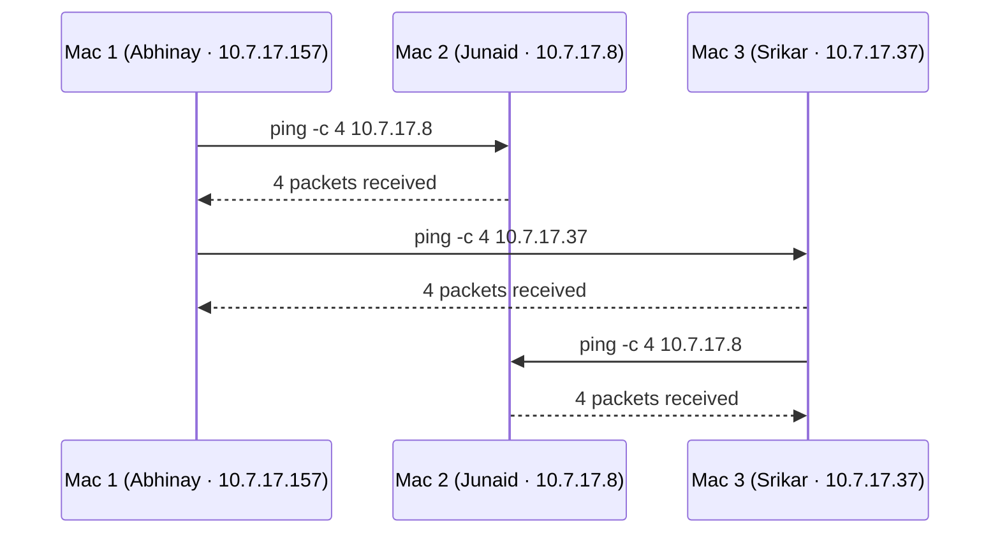
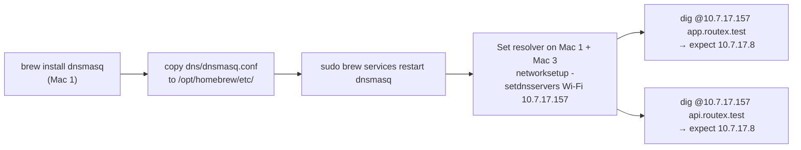
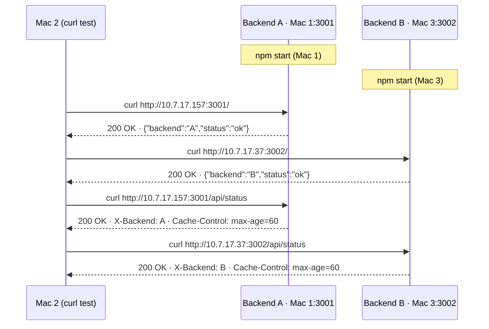
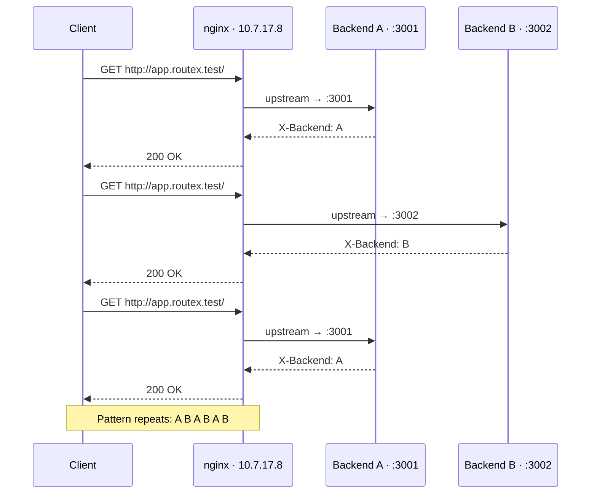
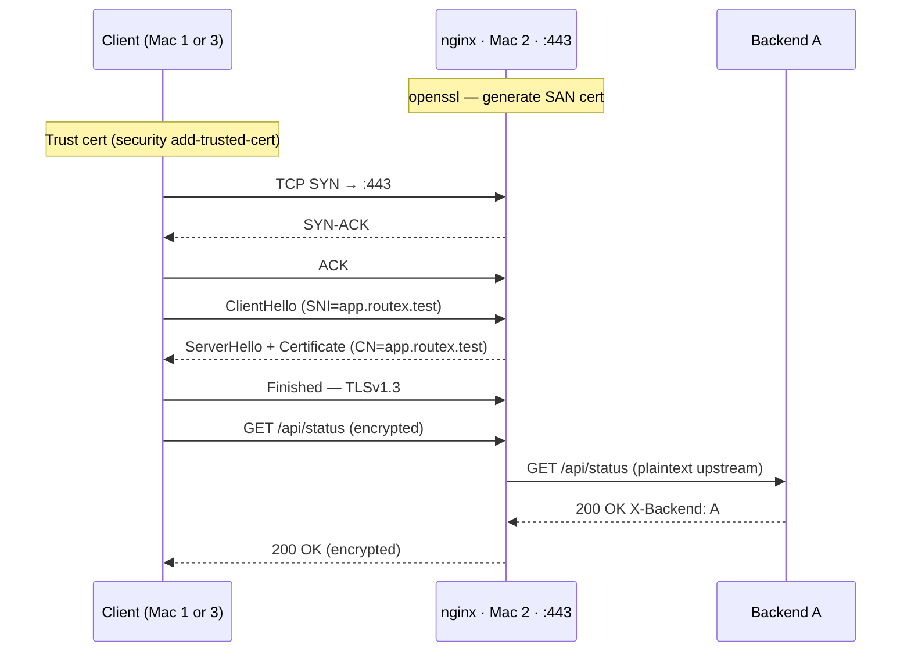
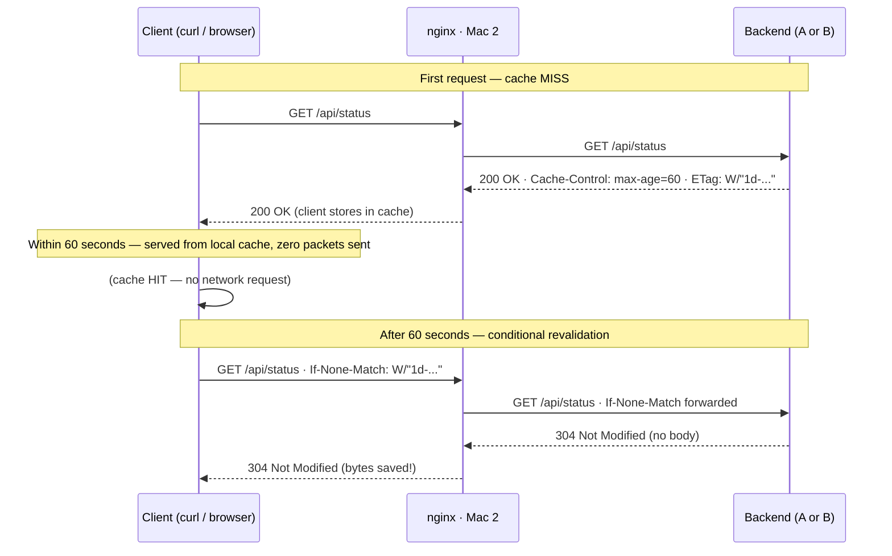
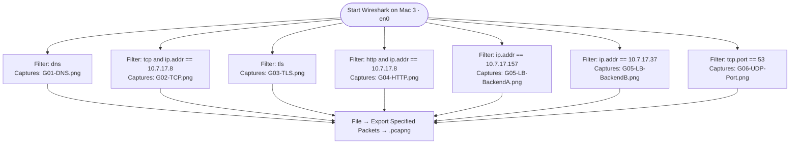
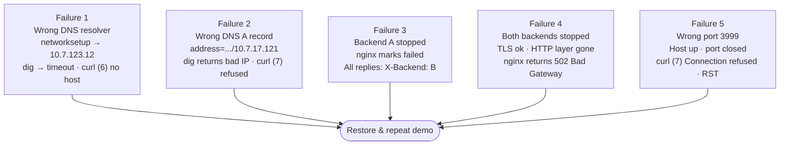

# Command Log — RouteX Phase 1

---

## Task A — Verify LAN Connectivity



```bash
# On each Mac — confirm assigned IP
ipconfig getifaddr en0

# Ping matrix — run from each Mac
ping -c 4 10.7.17.157   # Mac 1
ping -c 4 10.7.17.8     # Mac 2
ping -c 4 10.7.17.37    # Mac 3
```

---

## Task B — DNS Server



```bash
brew install dnsmasq
sudo cp dns/dnsmasq.conf /opt/homebrew/etc/dnsmasq.conf
sudo brew services restart dnsmasq

# Set resolver (Mac 1 AND Mac 3)
sudo networksetup -setdnsservers Wi-Fi 10.7.17.157

dig @10.7.17.157 app.routex.test   # → 10.7.17.8
dig @10.7.17.157 api.routex.test   # → 10.7.17.8
dig +short app.routex.test
```

---

## Task C — Backend Services



```bash
# Mac 1 — Backend A
cd backend-a && npm start

# Mac 3 — Backend B
cd backend-b && npm start

# Test from Mac 2
curl -s http://10.7.17.157:3001/
curl -s http://10.7.17.157:3001/api/status
curl -s http://10.7.17.37:3002/
curl -s http://10.7.17.37:3002/api/status
```

---

## Task D — Nginx Load Balancer



```bash
brew install nginx
sudo cp nginx/nginx.conf /opt/homebrew/etc/nginx/nginx.conf

nginx -t                    # must say: syntax is ok
sudo nginx
# or reload:
sudo nginx -s reload

# Prove round robin (6 requests → A B A B A B)
for i in 1 2 3 4 5 6; do
  curl -s http://app.routex.test/ | grep -o '"backend":"."'
done
```

---

## Task E — TLS / HTTPS



```bash
# Mac 2 — generate SAN cert
openssl req -x509 -newkey rsa:2048 -days 365 -nodes \
  -keyout tls/app.routex.test.key \
  -out    tls/app.routex.test.crt \
  -subj   "/CN=app.routex.test" \
  -addext "subjectAltName=DNS:app.routex.test,DNS:api.routex.test"

# Mac 1 + Mac 3 — trust the cert
sudo security add-trusted-cert -d -r trustRoot \
  -k /Library/Keychains/System.keychain app.routex.test.crt

# Test (no -k needed after trusting)
curl -v https://app.routex.test/api/status

# Verify TLS details
openssl s_client -connect app.routex.test:443 -servername app.routex.test < /dev/null
```

---

## Task F — HTTP Caching



```bash
# First request — see Cache-Control and ETag
curl -I https://app.routex.test/api/status

# Conditional GET — revalidation (304)
ETAG=$(curl -sI https://app.routex.test/api/status \
  | grep -i etag | awk '{print $2}' | tr -d '\r')
curl -I -H "If-None-Match: $ETAG" https://app.routex.test/api/status
# expect: HTTP/1.1 304 Not Modified
```

---

## Task G — Wireshark Captures



---

## Failures — Required Demonstrations



```bash
# Failure 1 — wrong resolver
sudo networksetup -setdnsservers Wi-Fi 10.7.123.12
dig app.routex.test           # timed out
curl -v https://app.routex.test/api/status  # curl (6)
sudo networksetup -setdnsservers Wi-Fi 10.7.17.157   # RESTORE

# Failure 2 — wrong A record (edit dnsmasq.conf → 10.7.17.121, restart)
dig +short app.routex.test    # 10.7.17.121 (wrong)
curl -v https://app.routex.test/api/status  # curl (7)
# RESTORE: fix dnsmasq.conf, brew services restart dnsmasq

# Failure 3 — stop Backend A (Ctrl+C on Mac 1)
curl https://app.routex.test/api/status  # X-Backend: B every time

# Failure 4 — stop both backends
curl -v https://app.routex.test/api/status  # 502 Bad Gateway

# Failure 5 — wrong port
curl -v http://10.7.17.37:3999/api/status  # curl (7) Connection refused
```
