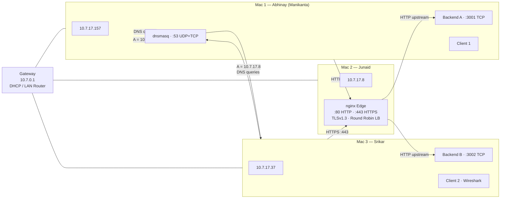
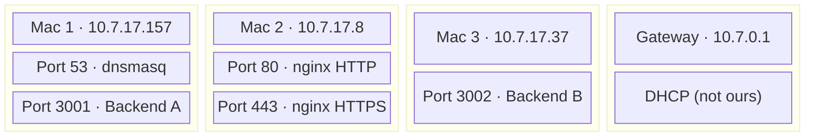
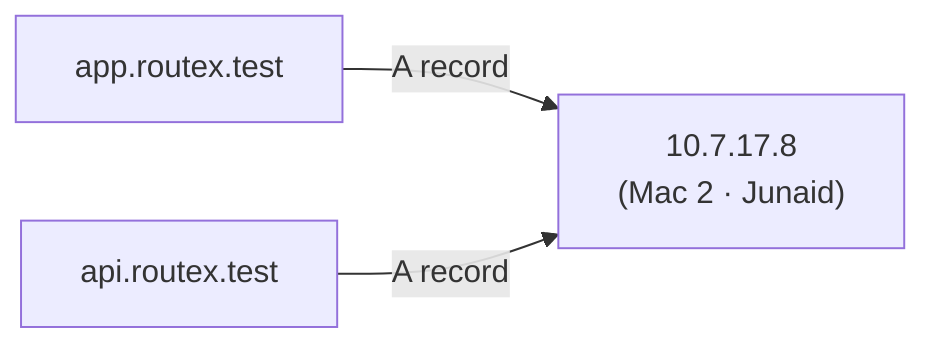
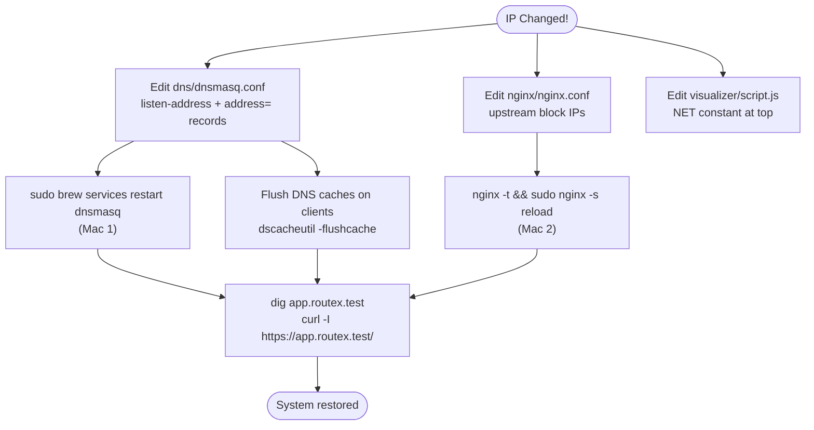

# IP Inventory — RouteX Phase 1

## Network Map

```mermaid
graph LR
    GW[" Gateway\n10.7.0.1\nDHCP / LAN Router"]

    subgraph Mac1["Mac 1 — Abhinay (Manikanta)"]
        direction TB
        M1IP[" 10.7.17.157"]
        M1DNS[" dnsmasq · :53 UDP+TCP"]
        M1BE[" Backend A · :3001 TCP"]
        M1C[" Client 1"]
    end

    subgraph Mac2["Mac 2 — Junaid"]
        direction TB
        M2IP[" 10.7.17.8"]
        M2EDGE[" nginx Edge\n:80 HTTP · :443 HTTPS\nTLSv1.3 · Round Robin LB"]
    end

    subgraph Mac3["Mac 3 — Srikar"]
        direction TB
        M3IP[" 10.7.17.37"]
        M3BE[" Backend B · :3002 TCP"]
        M3C[" Client 2 · Wireshark"]
    end

    GW --- Mac1
    GW --- Mac2
    GW --- Mac3

    Mac1 -- "DNS queries" --> M1DNS
    Mac3 -- "DNS queries" --> M1DNS
    M1DNS -- "A = 10.7.17.8" --> Mac1
    M1DNS -- "A = 10.7.17.8" --> Mac3

    Mac1 -- "HTTPS :443" --> M2EDGE
    Mac3 -- "HTTPS :443" --> M2EDGE

    M2EDGE -- "HTTP upstream" --> M1BE
    M2EDGE -- "HTTP upstream" --> M3BE
```

---

## Port Table

```mermaid
block-beta
  columns 4

  block:mac1:1
    columns 1
    h1["Mac 1 · 10.7.17.157"]:1
    p53["Port 53 · dnsmasq"]:1
    p3001["Port 3001 · Backend A"]:1
  end

  block:mac2:1
    columns 1
    h2["Mac 2 · 10.7.17.8"]:1
    p80["Port 80 · nginx HTTP"]:1
    p443["Port 443 · nginx HTTPS"]:1
  end

  block:mac3:1
    columns 1
    h3["Mac 3 · 10.7.17.37"]:1
    p3002["Port 3002 · Backend B"]:1
  end

  block:gw:1
    columns 1
    hgw["Gateway · 10.7.0.1"]:1
    pgw["DHCP (not ours)"]:1
  end
```

---

## DNS Records

```mermaid
graph LR
    A["app.routex.test"] -->|"A record"| IP["10.7.17.8\n(Mac 2 · Junaid)"]
    B["api.routex.test"] -->|"A record"| IP
```

---

## IP Change Protocol

```mermaid
flowchart TD
    START([" IP Changed!"])
    F1["Edit dns/dnsmasq.conf\nlisten-address + address= records"]
    F2["Edit nginx/nginx.conf\nupstream block IPs"]
    F3["Edit visualizer/script.js\nNET constant at top"]
    R1["sudo brew services restart dnsmasq\n(Mac 1)"]
    R2["nginx -t && sudo nginx -s reload\n(Mac 2)"]
    R3["Flush DNS caches on clients\ndscacheutil -flushcache"]
    TEST["dig app.routex.test\ncurl -I https://app.routex.test/"]
    DONE([" System restored"])

    START --> F1 & F2 & F3
    F1 --> R1
    F2 --> R2
    F1 --> R3
    R1 & R2 & R3 --> TEST
    TEST --> DONE
```
