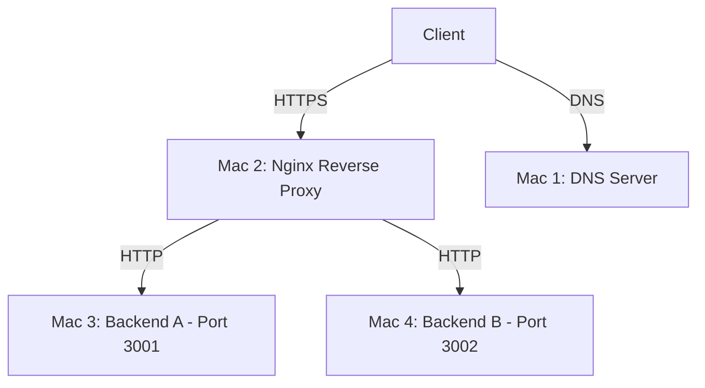

# Network Topology

*(Describe or insert a diagram of the network topology here)*

```mermaid
graph TD;
    Client-->|HTTPS| Nginx[Mac 2: Nginx Reverse Proxy];
    Nginx-->|HTTP| BackendA[Mac 3: Backend A - Port 3001];
    Nginx-->|HTTP| BackendB[Mac 4: Backend B - Port 3002];
    Client-->|DNS| DNS[Mac 1: DNS Server];
```
