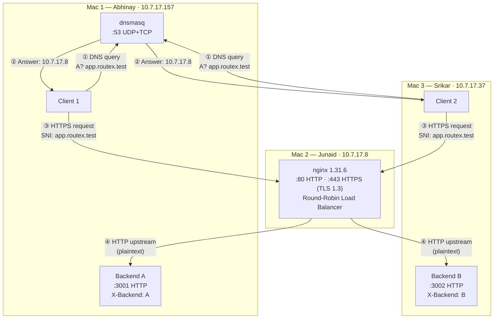
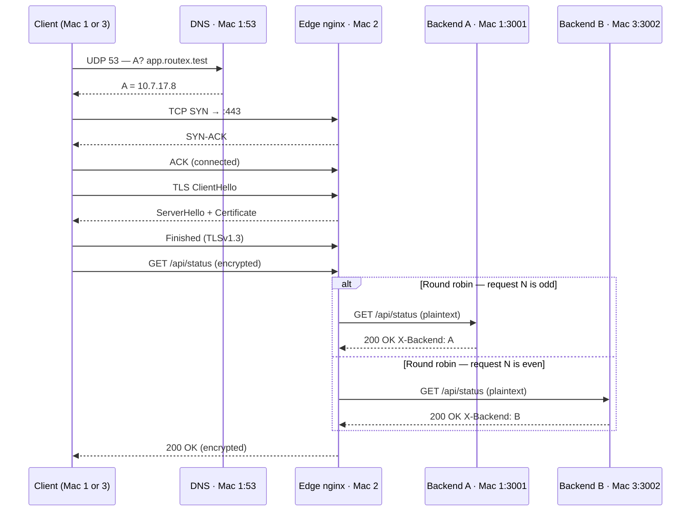

# Network Topology — RouteX Phase 1

## Team

| Mac | Person | Role(s) | IP Address |
|-----|--------|---------|------------|
| Mac 1 | **Abhinay (Manikanta)** | DNS Server (dnsmasq) · Backend A · Client 1 | `10.7.17.157` |
| Mac 2 | **Junaid** | Nginx Edge · Reverse Proxy · Load Balancer · TLS | `10.7.17.8` |
| Mac 3 | **Srikar** | Backend B · Client 2 · Wireshark capture | `10.7.17.37` |

Network: `10.7.0.0/19` · Gateway: `10.7.0.1`

---

## Architecture Diagram



---

## Request Flow (Step by Step)



---

## DNS Records (`dns/dnsmasq.conf` on Mac 1)

```
address=/app.routex.test/10.7.17.8
address=/api.routex.test/10.7.17.8
```

Both names point at the **edge** (Mac 2). Clients never use a backend IP.

---

## Required Requests Per Task (Evidence Checklist)

| Task | Min. Requests | Goal | Command |
|------|:---:|-------|---------|
| **Task B** – DNS works | 2 | One `dig` per client (Manikanta + Srikar) | `dig @10.7.17.157 app.routex.test` |
| **Task C** – Backends respond | 2 | Hit Backend A (`:3001`) and Backend B (`:3002`) directly | `curl http://10.7.17.157:3001/` |
| **Task D** – Load Balancer alternates | **6** | 3 rounds of Round Robin: A→B→A→B→A→B | `curl http://app.routex.test/` (×6) |
| **Task E** – TLS works | 2 | One HTTPS request each from Manikanta + Srikar | `curl https://app.routex.test/` |
| **Task F** – Cache-Control | 4 | Hit `/api/status` twice — 1st miss (200), 2nd revalidation (304) | `curl -I https://app.routex.test/api/status` |
| **Task G** – Wireshark capture | 1+ | Capture during any of the above; export as `.pcapng` | Wireshark on `en0` |

> **Minimum total requests to send: ~17**
> Capture at least one session per protocol: DNS/UDP, TCP handshake, TLS, HTTP.
